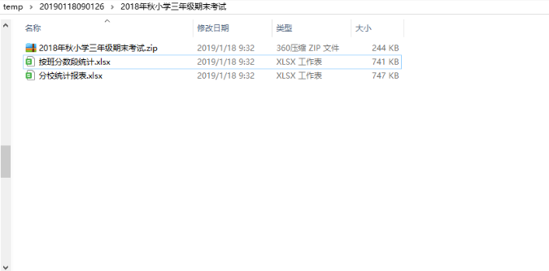

# Common-Utils

## illustration

* this is a tool-class project for excel operations 
* using jxl 
* using zip4j 
* using junit 
* using factory mode for processing

### POM

```xml
<dependencies>
    <!-- https://mvnrepository.com/artifact/jexcelapi/jxl -->
    <dependency>
        <groupId>jexcelapi</groupId>
        <artifactId>jxl</artifactId>
        <version>2.6</version>
    </dependency>
    <!-- https://mvnrepository.com/artifact/net.lingala.zip4j/zip4j -->
    <dependency>
        <groupId>net.lingala.zip4j</groupId>
        <artifactId>zip4j</artifactId>
        <version>1.3.2</version>
    </dependency>
    <!-- https://mvnrepository.com/artifact/junit/junit -->
    <dependency>
        <groupId>junit</groupId>
        <artifactId>junit</artifactId>
        <version>4.12</version>
        <scope>test</scope>
    </dependency>
    <!-- https://mvnrepository.com/artifact/log4j/log4j -->
    <dependency>
        <groupId>log4j</groupId>
        <artifactId>log4j</artifactId>
        <version>1.2.17</version>
    </dependency>
    <!-- https://mvnrepository.com/artifact/org.apache.commons/commons-lang3 -->
    <dependency>
        <groupId>org.apache.commons</groupId>
        <artifactId>commons-lang3</artifactId>
        <version>3.4</version>
    </dependency>
</dependencies>
```

### Key code

* For the main method use case, see `ExcelUtilTest`

```java
public class ExcelUtilTest extends TestCase {
    private static Logger log = Logger.getLogger(ExcelUtilTest.class.getClass());


    /**
     * @throws IOException
     * @throws WriteException
     */
    @Test
    public final void testWrite() throws IOException, WriteException {
        List<WorkBookEntity> workbookList = new ArrayList<WorkBookEntity>();

        String fileName = "2018年秋小学三年级期末考试";
        IExcelWriteFactory excelBook1 = ExcelWriteFactory.doWrite(ExcelType.TYPE_ABFK.getVal());
        IExcelWriteFactory excelBook2 = ExcelWriteFactory.doWrite(ExcelType.TYPE_ABFSD.getVal());
        IExcelWriteFactory excelBook3 = ExcelWriteFactory.doWrite(ExcelType.TYPE_ATKFK.getVal());
        IExcelWriteFactory excelBook4 = ExcelWriteFactory.doWrite(ExcelType.TYPE_AXFK.getVal());
        IExcelWriteFactory excelBook5 = ExcelWriteFactory.doWrite(ExcelType.TYPE_AXZF.getVal());
        IExcelWriteFactory excelBook6 = ExcelWriteFactory.doWrite(ExcelType.TYPE_ZFCJ.getVal());

        workbookList.add(excelBook1.write(fileName));
        workbookList.add(excelBook2.write(fileName));
        workbookList.add(excelBook3.write(fileName));
        workbookList.add(excelBook4.write(fileName));
        workbookList.add(excelBook5.write(fileName));
        workbookList.add(excelBook6.write(fileName));

        ExcelUtil.writeFactory(fileName, workbookList);
    }
}
```

* Factory pattern management paradigm

```java
public class ExcelWriteFactory {
    public static final int TYPE_ABFK = 1;//按班分科统计
    public static final int TYPE_ABFSD = 2;//按班分数段统计
    public static final int TYPE_ATKFK = 3;//按题块分科统计
    public static final int TYPE_AXFK = 4;//按校分科统计
    public static final int TYPE_AXZF = 5;//按校总分统计
    public static final int TYPE_ZFCJ = 6;//总分成绩汇总表

    public static IExcelWriteFactory doWrite(int type) {
        switch (type) {
            case TYPE_ABFK:
                return new ExcelWriteType1();
            case TYPE_ABFSD:
                return new ExcelWriteType2();
            case TYPE_ATKFK:
                return new ExcelWriteType1();
            case TYPE_AXFK:
                return new ExcelWriteType1();
            case TYPE_AXZF:
                return new ExcelWriteType1();
            case TYPE_ZFCJ:
                return new ExcelWriteType1();
            default:
                return new ExcelWriteType1();
        }
    }
}

```

* console log

```shell
09:32:26,291  INFO FileUtil:32 - >do createTimeSamp
09:32:26,295  INFO FileUtil:45 - >do assertFile
09:32:27,491  INFO FileUtil:45 - >do assertFile
09:32:27,959  INFO FileUtil:45 - >do assertFile
09:32:28,334  INFO FileUtil:45 - >do assertFile
09:32:28,573  INFO FileUtil:45 - >do assertFile
09:32:28,789  INFO FileUtil:45 - >do assertFile
09:32:29,108  INFO Class:56 - >do zipFile:c:\temp\20190118090126\2018年秋小学三年级期末考试\
09:32:29,109  INFO Class:60 - >end time:2.825s

Process finished with exit code 0

```

